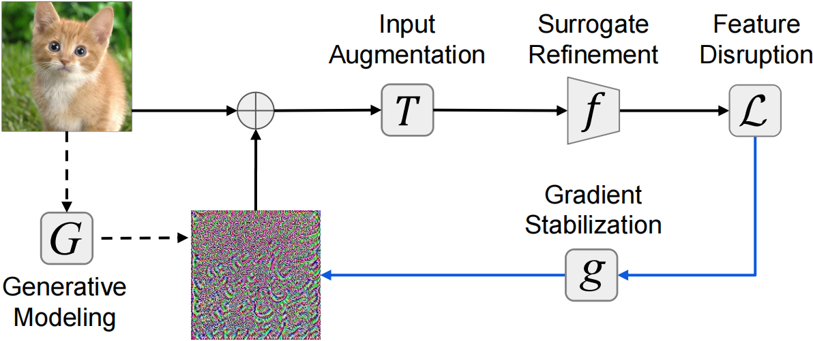

<h1 id="publications"></h1>

<h2 id="publications" style="margin: 0px 0px -30px;">Foundations of Adversarial Machine Learning</h2>

<ol class="bibliography">

<li>

  

    
<!--             <abbr class="badge">arXiv</abbr> -->
  

  

      
<a href="https://arxiv.org/abs/2310.11850">Revisiting Transferable Adversarial Image Examples: Attack Categorization, Evaluation Guidelines, and New Insights</a>

      
<strong>Zhengyu Zhao*</strong>, Hanwei Zhang*, Renjue Li*, Ronan Sicre, Laurent Amsaleg, Michael Backes, Qi Li, Chao Shen

<!--       
<em><strong>arXiv</strong>.</em>
      
 -->
    

      <a href="https://github.com/ZhengyuZhao/TransferAttackEval" class="btn btn-sm z-depth-0" role="button" target="_blank" style="font-size:12px;">Code</a>
    

  

</li> 

<li>

  

    
<!--             <abbr class="badge">arXiv</abbr> -->
  

  

      
<a href="https://arxiv.org/abs/2402.18370">Adversarial Example Soups: Improving Transferability and Stealthiness for Free
</a>

      
Bo Yang, Hengwei Zhang, Jindong Wang, Yulong Yang, Chenhao Lin, Chao Shen, <strong>Zhengyu Zhao</strong>

<!--       
<em><strong>arXiv</strong>.</em>
      
 -->
  

</li> 

<li>

  

    
<!--             <abbr class="badge">ICML</abbr> -->
  

  

      
<a href="https://arxiv.org/abs/2312.07364">Collapse-Aware Triplet Decoupling for Adversarially Robust Image Retrieval</a>

      
Qiwei Tian, Chenhao Lin, <strong>Zhengyu Zhao</strong>, Qian Li, Chao Shen

      
<em>International Conference on Machine Learning <strong>(ICML)</strong>, 2024.</em>
      

    

       <a href="https://arxiv.org/abs/2312.07364" class="btn btn-sm z-depth-0" role="button" target="_blank" style="font-size:12px;">Code</a>
    

  

</li>

<li>

  

    
<!--             <abbr class="badge">arXiv</abbr> -->
  

  

      
<a href="https://arxiv.org/abs/2305.05875">Quantization Aware Attack: Enhancing Transferable Adversarial Attacks by Model Quantization</a>

      
Yulong Yang, Chenhao Lin, Qian Li, <strong>Zhengyu Zhao</strong>, Haoran Fan, Dawei Zhou, Nannan Wang, Tongliang Liu, Chao Shen

      
<em>IEEE Transactions on Information Forensics and Security <strong>(TIFS)</strong>, 2024.</em>
      

    

      <a href="https://github.com/yyl-github-1896/QAA/" class="btn btn-sm z-depth-0" role="button" target="_blank" style="font-size:12px;">Code</a>
    

  

</li>

<li>

  

    
<!--             <abbr class="badge">ICML</abbr> -->
  

  

      
<a href="https://arxiv.org/abs/2301.13838">Image Shortcut Squeezing: Countering Perturbative Availability Poisons with Compression</a>

      
Zhuoran Liu, <strong>Zhengyu Zhao</strong>, Martha Larson

      
<em>International Conference on Machine Learning <strong>(ICML)</strong>, 2023.</em>
      

    

      <a href="https://github.com/liuzrcc/ImageShortcutSqueezing" class="btn btn-sm z-depth-0" role="button" target="_blank" style="font-size:12px;">Code</a>
    

  

</li>  
  
<li>

  

    
<!--             <abbr class="badge">ICLR</abbr> -->
  

  

      
<a href="https://openreview.net/forum?id=zKvm1ETDOq">Is Adversarial Training Really a Silver Bullet for Mitigating Data Poisoning?</a>

      
Rui Wen, <strong>Zhengyu Zhao</strong>, Zhuoran Liu, Michael Backes, Tianhao Wang, Yang Zhang

      
<em>International Conference on Learning Representations <strong>(ICLR)</strong>, 2023. <strong>(Spotlight)</strong></em>
      

    

      <a href="https://github.com/WenRuiUSTC/EntF" class="btn btn-sm z-depth-0" role="button" target="_blank" style="font-size:12px;">Code</a>
    

  

</li>  

<li>

  

    
<!--             <abbr class="badge">TIFS</abbr> -->
  

  

      
<a href="https://arxiv.org/abs/2011.06690">Adversarial Image Color Transformations in Explicit Color Filter Space</a>

      
<strong>Zhengyu Zhao</strong>, Zhuoran Liu, Martha Larson

      
<em>IEEE Transactions on Information Forensics and Security <strong>(TIFS)</strong>, 2023.</em>
      

    

      <a href="https://github.com/ZhengyuZhao/ACE" class="btn btn-sm z-depth-0" role="button" target="_blank" style="font-size:12px;">Code</a>
      <a href="https://www.bmvc2020-conference.com/conference/papers/paper_0099.html" class="btn btn-sm z-depth-0" role="button" target="_blank" style="font-size:12px;">Video</a>
      <a href="https://www.bmvc2020-conference.com/assets/papers/0099.pdf" class="btn btn-sm z-depth-0" role="button" target="_blank" style="font-size:12px;">BMVC 2020 version</a>
    

  

</li> 
  
  
<li>

  

    
<!--             <abbr class="badge">CCS</abbr> -->
  

  

      
<a href="https://arxiv.org/abs/2208.14933">Membership Inference Attacks by Exploiting Loss Trajectory</a>

      
Yiyong Liu, <strong>Zhengyu Zhao</strong>, Michael Backes, Yang Zhang

      
<em>ACM Conference on Computer and Communications Security <strong>(CCS)</strong>, 2022.</em>
      

    

      <a href="https://github.com/DennisLiu2022/Membership-Inference-Attacks-by-Exploiting-Loss-Trajectory" class="btn btn-sm z-depth-0" role="button" target="_blank" style="font-size:12px;">Code</a>
      <a href="https://zhengyuzhao.github.io/" class="btn btn-sm z-depth-0" role="button" target="_blank" style="font-size:12px;">Video</a>
    

  

</li>
  
<li>

  

    
<!--             <abbr class="badge">NeurIPS</abbr> -->
  

  

      
<a href="https://arxiv.org/abs/2012.11207">On Success and Simplicity: A Second Look at Transferable Targeted Attacks</a>

      
<strong>Zhengyu Zhao</strong>, Zhuoran Liu, Martha Larson

      
<em>Neural Information Processing Systems <strong>(NeurIPS)</strong>, 2021.</em>
      

    

      <a href="https://github.com/ZhengyuZhao/Targeted-Tansfer" class="btn btn-sm z-depth-0" role="button" target="_blank" style="font-size:12px;">Code</a>
      <a href="https://nips.cc/virtual/2021/poster/26087" class="btn btn-sm z-depth-0" role="button" target="_blank" style="font-size:12px;">Video</a>
      <a href="https://zhuanlan.zhihu.com/p/512550358" class="btn btn-sm z-depth-0" role="button" target="_blank" style="font-size:12px;">中文解读</a>
      <a href="https://ml.cs.tsinghua.edu.cn/ares-bench/#/leaderboard" class="btn btn-sm z-depth-0" role="button" target="_blank" style="font-size:12px;">Rank Top-1 on ARES Leaderboard</a>
    

  

</li>

<li>

  

    
<!--             <abbr class="badge">CVPR</abbr> -->
  

  

      
<a href="https://arxiv.org/abs/1911.02466">Towards Large yet Imperceptible Adversarial Image Perturbations with Perceptual Color Distance</a>

      
<strong>Zhengyu Zhao</strong>, Zhuoran Liu, Martha Larson

      
<em>IEEE Conference on Computer Vision and Pattern Recognition <strong>(CVPR)</strong>, 2020.</em>
      

    

      <a href="https://github.com/ZhengyuZhao/PerC-Adversarial" class="btn btn-sm z-depth-0" role="button" target="_blank" style="font-size:12px;">Code</a>
      <a href="https://www.youtube.com/watch?v=2j74B_9VaJ8" class="btn btn-sm z-depth-0" role="button" target="_blank" style="font-size:12px;">Video</a>
    

  

</li>

<li>

  

    
<!--             <abbr class="badge">ICMR</abbr> -->
  

  

      
<a href="https://arxiv.org/abs/1901.10332">Who's Afraid of Adversarial Queries? The Impact of Image Modifications on Content-based Image Retrieval</a>

      
Zhuoran Liu, <strong>Zhengyu Zhao</strong>, Martha Larson

      
<em>ACM International Conference on Multimedia Retrieval <strong>(ICMR)</strong>, 2019.</em>
      

    

      <a href="https://github.com/liuzrcc/PIRE" class="btn btn-sm z-depth-0" role="button" target="_blank" style="font-size:12px;">Code</a>
    

  

</li>  

</ol>

<h2 id="publications" style="margin: 0px 0px -30px;">Applications of Adversarial Machine Learning</h2>

<ol class="bibliography">

<li>

  

    
<!--             <abbr class="badge">arXiv</abbr> -->
  

  

      
<a href="https://arxiv.org/abs/2407.09295">Security Matrix for Multimodal Agents on Mobile Devices: A Systematic and Proof of Concept Study</a>

      
Yulong Yang, Xinshan Yang, Shuaidong Li, Chenhao Lin, <strong>Zhengyu Zhao</strong>, Chao Shen, Tianwei Zhang

<!--       
<em><strong>arXiv</strong>.</em>
      
 -->
  

</li> 

<li>

  

    
<!--             <abbr class="badge">arXiv</abbr> -->
  

  

      
<a href="https://arxiv.org/abs/2408.11313">Unlocking Adversarial Suffix Optimization Without Affirmative Phrases: Efficient Black-box Jailbreaking via LLM as Optimizer</a>

      
Weipeng Jiang, Zhenting Wang, Juan Zhai, Shiqing Ma, <strong>Zhengyu Zhao</strong>, Chao Shen

<!--       
<em><strong>arXiv</strong>.</em>
      
 -->
  

</li> 

<li>

  

    
<!--             <abbr class="badge">arXiv</abbr> -->
  

  

      
<a href="https://arxiv.org/abs/2406.05810">ControlLoc: Physical-World Hijacking Attack on Visual Perception in Autonomous Driving</a>

      
Chen Ma*, Ningfei Wang*, <strong>Zhengyu Zhao</strong>, Qian Wang, Qi Alfred Chen, Chao Shen

<!--       
<em><strong>arXiv</strong>.</em>
      
 -->
  

</li> 

<li>

  

    
<!--             <abbr class="badge">arXiv</abbr> -->
  

  

      
<a href="https://arxiv.org/abs/2308.07847">Robustness Over Time: Understanding Adversarial Examples' Effectiveness on Longitudinal Versions of Large Language Models</a>

      
Yugeng Liu*, Tianshuo Cong*, <strong>Zhengyu Zhao</strong>, Michael Backes, Yun Shen, Yang Zhang

<!--       
<em><strong>arXiv</strong>.</em>
      
 -->
  

</li> 

<li>

  

    
<!--             <abbr class="badge">arXiv</abbr> -->
  

  

      
<a href="https://arxiv.org/abs/2306.07754">Generative Watermarking Against Unauthorized Subject-Driven Image Synthesis</a>

      
Yihan Ma, <strong>Zhengyu Zhao</strong>, Xinlei He, Zheng Li, Michael Backes, Yang Zhang

<!--       
<em><strong>arXiv</strong>.</em>
      
 -->
    

      <a href="https://blog.metaphysic.ai/personalized-protection-against-stable-diffusion-deepfaking/" class="btn btn-sm z-depth-0" role="button" target="_blank" style="font-size:12px;">Metaphysic.ai Blog, by Martin Anderson</a>
    

  

</li>  

<li>

  

    
<!--             <abbr class="badge">arXiv</abbr> -->
  

  

      
<a href="https://arxiv.org/abs/2310.07632">Prompt Backdoors in Visual Prompt Learning</a>

      
Hai Huang, <strong>Zhengyu Zhao</strong>, Yun Shen, Michael Backes, Yang Zhang

<!--       
<em><strong>arXiv</strong>.</em>
      
 -->
  

</li>  

<li>

  

    
<!--             <abbr class="badge">CVPR</abbr> -->
  

  

      
<a href="https://arxiv.org//abs/2403.17301">Physical 3D Adversarial Attacks against Monocular Depth Estimation in Autonomous Driving</a>

      
Junhao Zheng, Chenhao Lin, Jiahao Sun, <strong>Zhengyu Zhao</strong>, Qian Li, Chao Shen

      
<em>IEEE Conference on Computer Vision and Pattern Recognition <strong>(CVPR)</strong>, 2024.</em>
      

    

       <a href="https://github.com/Gandolfczjh/3D2Fool" class="btn btn-sm z-depth-0" role="button" target="_blank" style="font-size:12px;">Code</a>
    

  

</li>

<li>

  

    
<!--             <abbr class="badge">arXiv</abbr> -->
  

  

      
<a href="https://ieeexplore.ieee.org/document/10531252">Exploiting the Adversarial Example Vulnerability of Transfer Learning of Source Code</a>

      
Yulong Yang, Haoran Fan, Chenhao Lin, Qian Li, <strong>Zhengyu Zhao</strong>, Chao Shen

      
<em>IEEE Transactions on Information Forensics and Security <strong>(TIFS)</strong>, 2024.</em>
      

    

      <a href="https://github.com/yyl-github-1896/CodeTAE" class="btn btn-sm z-depth-0" role="button" target="_blank" style="font-size:12px;">Code</a>
    

  

</li>

<li>

  

    
<!--             <abbr class="badge">arXiv</abbr> -->
  

  

      
<a href="https://ieeexplore.ieee.org/document/10531252">Towards Transferable and Stealthy Attacks against Object Detection in Autonomous Driving Systems</a> (in Chinese)

      
Junhao Zheng, Chenhao Lin, <strong>Zhengyu Zhao</strong>, Ziyi Jia, Libing Wu, Chao Shen

      
<em>Journal of Computer Research and Development <strong>(CRaD)</strong>, 2024.</em>
      

    

      <a href="https://github.com/yyl-github-1896/CodeTAE" class="btn btn-sm z-depth-0" role="button" target="_blank" style="font-size:12px;">Code</a>
    

  

</li>

<li>

  

    
<!--             <abbr class="badge">NAACL</abbr> -->
  

  

      
<a href="https://arxiv.org/abs/2310.07676">Composite Backdoor Attacks Against Large Language Models</a>

      
Hai Huang, <strong>Zhengyu Zhao</strong>, Yun Shen, Michael Backes, Yang Zhang

      
<em>North American Chapter of the Association for Computational Linguistics <strong>(NAACL) Findings</strong>, 2024.</em>
      

        

       <a href="https://github.com/MiracleHH/CBA" class="btn btn-sm z-depth-0" role="button" target="_blank" style="font-size:12px;">Code</a>
    

  

</li> 
  
  
<li>

  

    
<!--             <abbr class="badge">NDSS</abbr> -->
  

  

      
<a href="https://arxiv.org/abs/2011.09877">Screen Gleaning: A Screen Reading TEMPEST Attack on Mobile Devices Exploiting an Electromagnetic Side Channel</a>

      
Zhuoran Liu, Niels Samwel, Léo Weissbart, <strong>Zhengyu Zhao</strong>, Dirk Lauret, Lejla Batina, Martha Larson

      
<em>Network and Distributed System Security Symposium <strong>(NDSS)</strong>, 2021.</em>
      

    

      <a href="https://github.com/cescalab/screen_gleaning" class="btn btn-sm z-depth-0" role="button" target="_blank" style="font-size:12px;">Code</a>
      <a href="https://www.youtube.com/watch?v=qEXwe58IVFc" class="btn btn-sm z-depth-0" role="button" target="_blank" style="font-size:12px;">Video</a>
    

  

</li>
  
<li>

  

    
<!--             <abbr class="badge">ACM MM</abbr> -->
  

  

      
<a href="https://arxiv.org/abs/1807.08624">From Volcano to Toyshop: Adaptive Discriminative Region Discovery for Scene Recognition</a>

      
<strong>Zhengyu Zhao</strong>, Martha Larson

      
<em>ACM International Conference on Multimedia <strong>(ACM MM)</strong>, 2018.</em>
      

    

      <a href="https://github.com/ZhengyuZhao/Adi-Red-Scene" class="btn btn-sm z-depth-0" role="button" target="_blank" style="font-size:12px;">Code</a>
      <a href="https://dl.acm.org/citation.cfm?id=3351169" class="btn btn-sm z-depth-0" role="button" target="_blank" style="font-size:12px;">Reproducibility companion paper at <strong>ACM MM</strong> 2019</a>
    

  

</li>

</ol>

<h2 id="publications" style="margin: 0px 0px -30px;">Detection of AI-generated Media</h2>

<ol class="bibliography">

<li>

  

    
<!--             <abbr class="badge">arXiv</abbr> -->
  

  

      
<a href="https://arxiv.org/abs/2309.01104">Evading Deepfake Detectors via Black-box 3D Adversarial Head Turn</a>

      
Weijie Wang, <strong>Zhengyu Zhao</strong>, Bo Li, Nicu Sebe, Bruno Lepri

<!--       
<em><strong>arXiv</strong>.</em>
      
 -->
  

</li>  

<li>

  

    
<!--             <abbr class="badge">arXiv</abbr> -->
  

  

      
<a href="https://arxiv.org/abs/2407.10575">A Survey of Defenses against AI-generated Visual Media: Detection, Disruption, and Authentication</a>

      
Jingyi Deng, Chenhao Lin, <strong>Zhengyu Zhao</strong>, Shuai Liu, Qian Wang, Chao Shen

<!--       
<em><strong>arXiv</strong>.</em>
      
 -->
  

</li>  

<li>

  

    
<!--             <abbr class="badge">NeurIPS</abbr> -->
  

  

      
<a href="https://openreview.net/forum?id=NtNTfRTjE8">Breaking Semantic Artifacts for Generalized AI-generated Image Detection</a>

      
Chende Zheng, Chenhao Lin, <strong>Zhengyu Zhao</strong>, Hang Wang, Xu Guo, Shuai Liu, Chao Shen

      
<em>Neural Information Processing Systems <strong>(NeurIPS)</strong>, 2024.</em>
      

  

</li>

<li>

  

    
<!--             <abbr class="badge">arXiv</abbr> -->
  

  

      
<a href="https://arxiv.org/abs/2305.05875">Exploiting Facial Relationships and Feature Aggregation for Multi-Face Forgery Detection</a>

      
Chenhao Lin, Fangbin Yi, Hang Wang, Jingyi Deng, <strong>Zhengyu Zhao</strong>, Qian Li, Chao Shen

      
<em>IEEE Transactions on Information Forensics and Security <strong>(TIFS)</strong>, 2024.</em>
      

    

      <a href="https://github.com/yyl-github-1896/QAA/" class="btn btn-sm z-depth-0" role="button" target="_blank" style="font-size:12px;">Code</a>
    

  

</li>

</ol>

